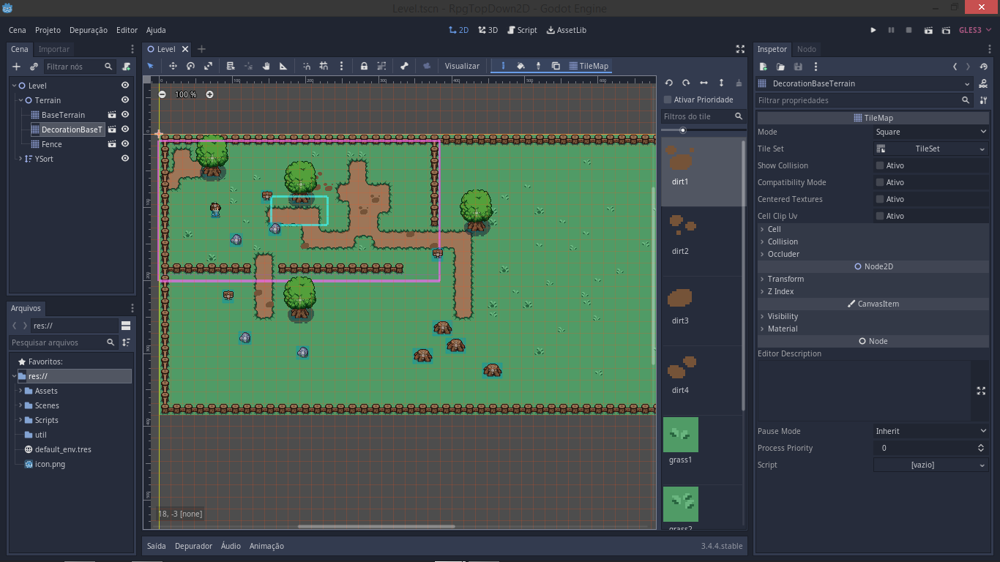
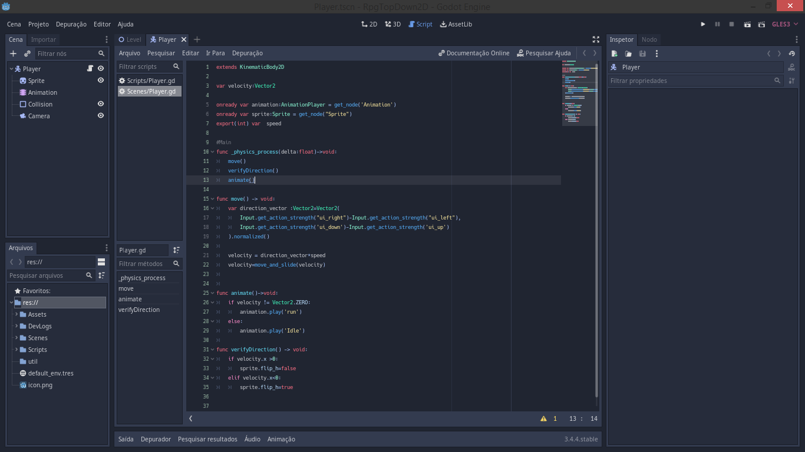
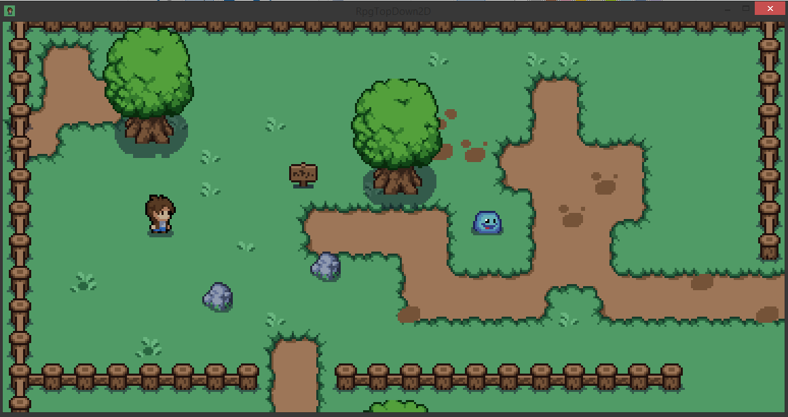
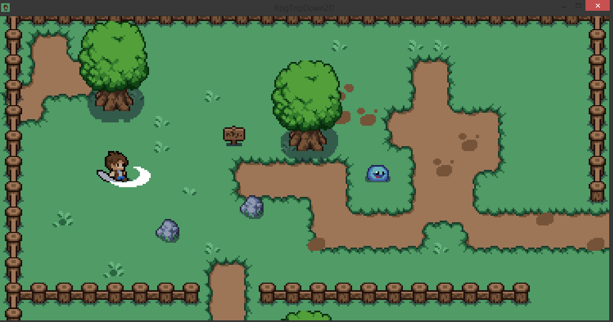
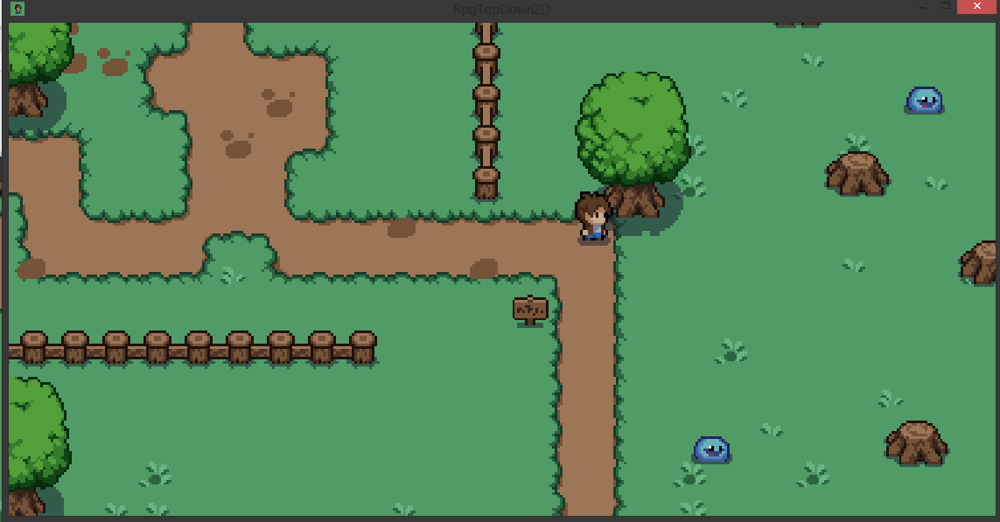

# 2D RPG made with GODOT Engine
A 2D RPG game, made with Godot game Engine, while I was learning how to use it

I'm a lover of RPGs, and I aways wanted to create something, but... not using a tool like RPG maker or something easier, I know that I can create something, coding! and then I decided to learn GDScript

These tools are amazing! I'm so excited to see my progress, and maybe finally create my own RPG game!

<h1>----Details----</h1>

Idle

Attacking

Dying

<h1>Enemy</h1>

